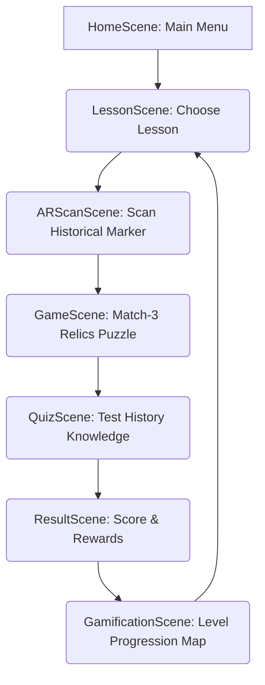

# History AR Mobile — Game Design & Architecture

Welcome to **History AR Mobile**, an innovative mobile game that blends educational historical learning with engaging Match-3 puzzle gameplay and interactive Augmented Reality (AR) experiences.

---

## 💡 Game Idea & Concept

**History AR Mobile** transforms traditional history education into a gamified, interactive journey. Players scan real-world history markers/images to unlock historical relics in AR, complete Match-3 puzzles representing historical tasks, read educational lessons, and challenge themselves with quizzes to earn rewards.

### Core Gameplay Pillars
1. **Interactive AR Discovery**: Use the device camera to scan physical historical image markers. Instantly project detailed 3D historical models, listen to voice narration, and inspect relics using gestures (rotate, pinch to zoom).
2. **Match-3 Board Puzzle**: Engage in Match-3 levels (Timer, Moves, and Time Attack modes) themed around historical eras. Players match relics, tools, or elements to complete objectives, supported by special items (bombs, rockets) and an auto-play bot.
3. **Educational History Lessons**: Step-by-step learning cards displaying text, remote images, and videos fetched dynamically from a web API.
4. **Interactive Quiz System**: Challenge players with multiple-choice quizzes to test knowledge retention. Results contribute to their profile progress and scores.
5. **Gamification Map**: A visual level progression map where players select levels, view unlocked scenarios, and track their scores/badges.

---

## 🕹️ Game Flow

1. **Home / Menu**: Launch the game, customize settings, and start.
2. **Lesson**: Read card-by-card info about historical events/artifacts.
3. **AR Scan**: Scan physical markers to interact with 3D models and hear audios.
4. **Match-3 Game**: Clear grids of relic-themed tiles within time/moves limits.
5. **Quiz**: Answer multiple-choice questions based on the lesson and AR scans.
6. **Result**: Display scores, correct answers, and achievement details.
7. **Progression Map**: Show completed areas and select the next historical epoch.

---

## 📂 Project Structure & Architecture

Below is the directory structure under `Assets/Scripts` organizing the Unity codebase:

### 1. `Assets/Scripts/API/`
Handles remote communications with the historical database and backend platform.
*   `ARLessonLoader.cs` — Loads lesson assets dynamically.
*   `LessonApiService.cs`, `QuizApiService.cs`, `GamificationApiService.cs` — REST API calls for fetching content.

### 2. `Assets/Scripts/AR/`
Manages Augmented Reality scanning, marker events, and 3D prefab interactions.
*   `ARModelInteraction.cs` — Rotate and scale the 3D historical relics.
*   `MarkerDetectedTrigger.cs` — Triggers actions when a physical target is recognized.
*   `PreviewModelPresenter.cs` & `PreviewModelRegistry.cs` — Handles presenting registered 3D models.

### 3. `Assets/Scripts/Board/`
Contains the Match-3 puzzle board logical and visual components.
*   `Board.cs`, `Cell.cs` — Grid generation, cell matching logic, and gravity.
*   `Item.cs`, `NormalItem.cs`, `BonusItem.cs` — Types of matching tiles (normal and special/clear-line items).

### 4. `Assets/Scripts/Controllers/`
The brain of the puzzle gameplay, state machines, and automated testing helpers.
*   `GameManager.cs` — Controls overall setup, states, and scene loading.
*   `BoardController.cs` — Coordinates board physics, tile swaps, and board state.
*   `AutoPlayBot.cs` — Automatically solves Match-3 boards (useful for playable ads or testing).
*   `LevelCondition.cs`, `LevelMoves.cs`, `LevelTime.cs` — Level goal checkers.

### 5. `Assets/Scripts/Lesson/` & `Quiz/`
Interactive step-by-step card screens and the multiple-choice engine.
*   `LessonStepUIController.cs` — Animates and scrolls lesson slides.
*   `QuizSceneManager.cs` & `ResultSceneManager.cs` — Quiz loops, feedback, and final score calculations.

### 6. `Assets/Scripts/UI/`
Visual layouts, transitions, safe area scaling, and HUD overlays.
*   `SceneTransitionManager.cs` — Smooth loading screen transitions with progress bars.
*   `UIMainManager.cs` — Main hub for the in-game puzzle canvas HUD.
*   `SafeArea.cs` — Adapts layouts for mobile screens (notches/pill cameras).

### 7. `Assets/Scripts/Utility/` & `Utilities/`
Core managers, constants, and global helper functions.
*   `DynamicSpriteManager.cs` — Efficiently downloads and caches dynamic historical images/sprites.
*   `Constants.cs` — Holds hardcoded paths for items, prefabs, and resources.
