# 🎮 LUỒNG CHƠI GAME MATCH-3 — PHÂN TÍCH TOÀN DIỆN

> [!NOTE]
> Tài liệu này mô tả **toàn bộ luồng** game Match-3 (xếp cá lịch sử) trong dự án ArHistoryMobile.
> Mục tiêu: đọc xong có thể **tự code lại** bất kỳ phần nào.

---

## 1. KIẾN TRÚC TỔNG QUAN — CLASS MAP

```mermaid
graph TB
    subgraph "🎯 Controllers (Bộ điều khiển)"
        GM["GameManager<br/>Quản lý trạng thái game"]
        BC["BoardController<br/>Xử lý input + điều phối"]
        SBC["SlotBarController<br/>Khay chứa + matching"]
        APB["AutoPlayBot<br/>Bot chơi tự động"]
        LC["LevelCondition<br/>Điều kiện kết thúc (base)"]
        LM["LevelMoves : LevelCondition<br/>Đếm nước đi"]
        LT["LevelTime : LevelCondition<br/>Đếm ngược thời gian"]
    end

    subgraph "🧱 Board (Bàn chơi)"
        B["Board<br/>Lưới ô + logic fill"]
        C["Cell<br/>Một ô trên lưới"]
        I["Item<br/>Vật phẩm cơ bản (base)"]
        NI["NormalItem : Item<br/>Cá bình thường (8 loại)"]
        BI["BonusItem : Item<br/>Vật phẩm đặc biệt"]
    end

    subgraph "🖼️ UI (Giao diện)"
        UMM["UIMainManager<br/>Bộ chuyển đổi panel"]
        PM["UIPanelMain<br/>Menu chọn chế độ"]
        PG["UIPanelGame<br/>Màn hình đang chơi"]
        PP["UIPanelPause<br/>Màn hình tạm dừng"]
        PGO["UIPanelGameOver<br/>Màn hình thua"]
        PW["UIPanelWin<br/>Màn hình thắng"]
        M3P["Match3NotePopup<br/>Popup kiến thức lịch sử"]
        STM["SceneTransitionManager<br/>Chuyển scene + loading"]
    end

    subgraph "🗄️ Data & Utility"
        GS["GameSettings<br/>Cấu hình ScriptableObject"]
        DSM["DynamicSpriteManager<br/>Tải sprite từ server"]
        CONST["Constants<br/>Đường dẫn prefab"]
        UTILS["Utils<br/>Hàm tiện ích random"]
        AC["AppConfig<br/>Cấu hình server URL"]
    end

    GM -->|"sở hữu"| BC
    GM -->|"sở hữu"| UMM
    BC -->|"sở hữu"| B
    BC -->|"sở hữu"| SBC
    BC -->|"sở hữu"| APB
    B -->|"chứa mảng"| C
    C -->|"chứa 1"| I
    NI -.->|"kế thừa"| I
    BI -.->|"kế thừa"| I
    LM -.->|"kế thừa"| LC
    LT -.->|"kế thừa"| LC
    UMM -->|"quản lý"| PM
    UMM -->|"quản lý"| PG
    UMM -->|"quản lý"| PP
    UMM -->|"quản lý"| PGO
    UMM -->|"quản lý"| PW
    SBC -->|"hiển thị"| M3P
    NI -->|"lấy sprite"| DSM
    GM -->|"đọc config"| GS
```

---

## 2. TRÁCH NHIỆM TỪNG CLASS

| Class | File | Trách nhiệm |
|-------|------|-------------|
| [GameManager](file:///d:/ArHistoryMobile/Assets/Scripts/Controllers/GameManager.cs) | `Controllers/` | **Trung tâm điều khiển**. Quản lý state machine (SETUP → MAIN_MENU → GAME_STARTED → PAUSE/GAME_OVER/GAME_WIN). Load level, tạo BoardController, phát event `StateChangedAction`. |
| [BoardController](file:///d:/ArHistoryMobile/Assets/Scripts/Controllers/BoardController.cs) | `Controllers/` | **Xử lý input người chơi** (click chuột/touch). Khởi tạo Board, SlotBarController, AutoPlayBot. Chạy coroutine Time Attack. Gọi `SlotBarController.PickupItem()` khi click vào cá. |
| [SlotBarController](file:///d:/ArHistoryMobile/Assets/Scripts/Controllers/SlotBarController.cs) | `Controllers/` | **Khay chứa 5 slot** dưới bàn chơi. Nhận cá từ board, kiểm tra match (3 cá liên tiếp cùng loại), hiển thị popup kiến thức, phán thắng/thua. |
| [AutoPlayBot](file:///d:/ArHistoryMobile/Assets/Scripts/Controllers/AutoPlayBot.cs) | `Controllers/` | **Bot chơi tự động** (AUTO_WIN hoặc AUTO_LOSE). Chọn cá thông minh để thắng hoặc cố tình chọn sai để thua. |
| [Board](file:///d:/ArHistoryMobile/Assets/Scripts/Board/Board.cs) | `Board/` | **Quản lý lưới ô**. Tạo grid Cell[x,y], fill cá (đảm bảo mỗi loại 3 con), shuffle, kiểm tra board trống. |
| [Cell](file:///d:/ArHistoryMobile/Assets/Scripts/Board/Cell.cs) | `Board/` | **Một ô** trên lưới. Lưu tọa độ (x,y), tham chiếu Item, 4 ô lân cận (up/down/left/right). |
| [Item](file:///d:/ArHistoryMobile/Assets/Scripts/Board/Item.cs) | `Board/` | **Lớp cơ sở** cho vật phẩm. Quản lý View (GameObject), animation (DOTween). |
| [NormalItem](file:///d:/ArHistoryMobile/Assets/Scripts/Board/NormalItem.cs) | `Board/` | **Cá bình thường**. Có 8 loại (TYPE_ONE..TYPE_EIGHT). Load sprite động từ DynamicSpriteManager. |
| [BonusItem](file:///d:/ArHistoryMobile/Assets/Scripts/Board/BonusItem.cs) | `Board/` | **Vật phẩm đặc biệt**. Nổ hàng ngang/dọc/bomb khi match. (Hiện tại không sử dụng trong luồng chính) |
| [GameSettings](file:///d:/ArHistoryMobile/Assets/Scripts/GameSettings.cs) | Root | **ScriptableObject** cấu hình: BoardSizeX=5, BoardSizeY=5, MatchesMin=3, LevelMoves=16, LevelTime=30s. |
| [UIMainManager](file:///d:/ArHistoryMobile/Assets/Scripts/UI/UIMainManager.cs) | `UI/` | **Điều phối UI panel**. Lắng nghe `StateChangedAction`, ẩn/hiện panel phù hợp. |
| [DynamicSpriteManager](file:///d:/ArHistoryMobile/Assets/Scripts/Utility/DynamicSpriteManager.cs) | `Utility/` | **Singleton**. Tải hình cá từ server API (`/match3/game`), cache vào disk + memory. Mỗi loại cá có 3 URL ảnh + 1 note kiến thức. |
| [Match3NotePopup](file:///d:/ArHistoryMobile/Assets/Scripts/UI/Match3NotePopup.cs) | `UI/` | **Popup kiến thức lịch sử**. Hiện sau khi match 3 cá. Có thể render mô hình 3D hoặc ảnh kèm text. |
| [SceneTransitionManager](file:///d:/ArHistoryMobile/Assets/Scripts/UI/SceneTransitionManager.cs) | `UI/` | **Singleton**. Chuyển scene với loading screen (fade in/out, progress bar, tips). |

---

## 3. STATE MACHINE — MÁY TRẠNG THÁI

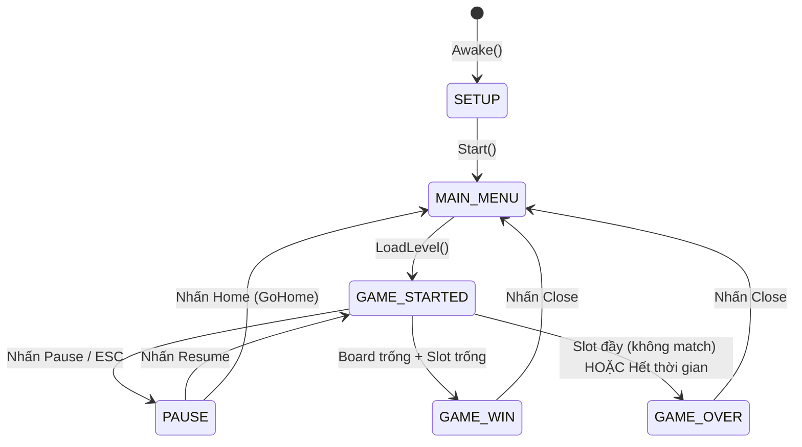

### Khi state thay đổi, xảy ra gì?

| State | Panel hiển thị | Hành động |
|-------|---------------|-----------|
| `SETUP` | Không có | `GameManager.Awake()`: Load GameSettings, tìm UIMainManager |
| `MAIN_MENU` | `UIPanelMain` | Hiện menu chọn chế độ (Timer/Moves/TimeAttack/AutoWin/AutoLose) |
| `GAME_STARTED` | `UIPanelGame` | Board hiển thị, người chơi có thể click. `IsBusy = false` |
| `PAUSE` | `UIPanelPause` | `DOTween.PauseAll()`, `IsBusy = true`. Board ngưng xử lý input |
| `GAME_OVER` | `UIPanelGameOver` | Hiện nút Close → quay về MAIN_MENU |
| `GAME_WIN` | `UIPanelWin` | Hiện nút Close → quay về MAIN_MENU |

---

## 4. LUỒNG KHỞI TẠO — TỪ KHI MỞ APP

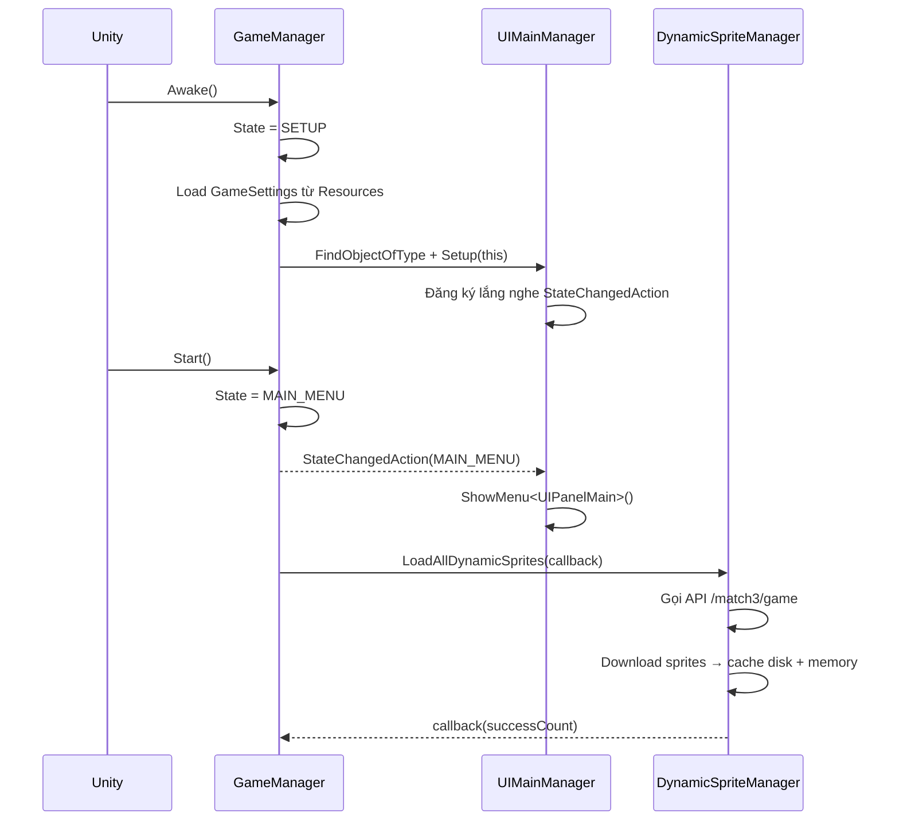

### Chi tiết `DynamicSpriteManager.LoadAllDynamicSprites()`:

1. **Gọi API** `GET {AppConfig.ApiBaseUrl}/match3/game`
2. **Parse JSON** → `Match3GameResponse` chứa danh sách `Match3Set`
3. Mỗi `Match3Set` có: `imageUrl1`, `imageUrl2`, `imageUrl3`, `note`, `noteModelCode`
4. **Map** set[0] → TYPE_ONE, set[1] → TYPE_TWO, ..., set[7] → TYPE_EIGHT
5. **Download từng ảnh**: kiểm tra disk cache trước → nếu có thì load từ file → nếu không thì download từ URL → lưu vào disk cache
6. Khi xong: `IsLoaded = true`, fire event `OnSpritesLoaded`

---

## 5. LUỒNG BẮT ĐẦU GAME — KHI NHẤN NÚT CHỌN CHẾ ĐỘ

### 5.1. Sơ đồ: Nhấn nút → Chạy hàm nào?

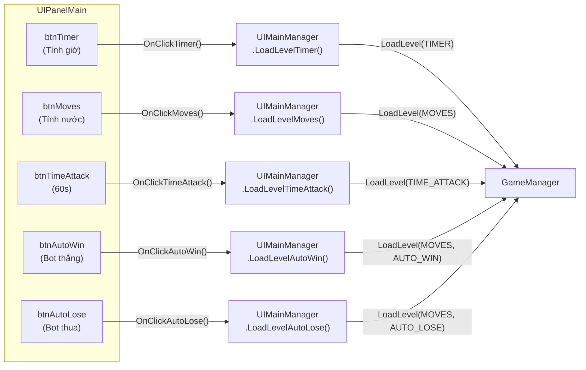

### 5.2. Bảng chi tiết button → hàm

| Button | Click Handler | Gọi tới | Tham số |
|--------|-------------|---------|---------|
| `btnTimer` | `UIPanelMain.OnClickTimer()` | `UIMainManager.LoadLevelTimer()` → `GameManager.LoadLevel(TIMER)` | mode=TIMER, autoPlay=NONE |
| `btnMoves` | `UIPanelMain.OnClickMoves()` | `UIMainManager.LoadLevelMoves()` → `GameManager.LoadLevel(MOVES)` | mode=MOVES, autoPlay=NONE |
| `btnTimeAttack` | `UIPanelMain.OnClickTimeAttack()` | `UIMainManager.LoadLevelTimeAttack()` → `GameManager.LoadLevel(TIME_ATTACK)` | mode=TIME_ATTACK, autoPlay=NONE |
| `btnAutoWin` | `UIPanelMain.OnClickAutoWin()` | `UIMainManager.LoadLevelAutoWin()` → `GameManager.LoadLevel(MOVES, AUTO_WIN)` | mode=MOVES, autoPlay=AUTO_WIN |
| `btnAutoLose` | `UIPanelMain.OnClickAutoLose()` | `UIMainManager.LoadLevelAutoLose()` → `GameManager.LoadLevel(MOVES, AUTO_LOSE)` | mode=MOVES, autoPlay=AUTO_LOSE |

### 5.3. Chi tiết `GameManager.LoadLevel()` → `ExecuteLoadLevel()`

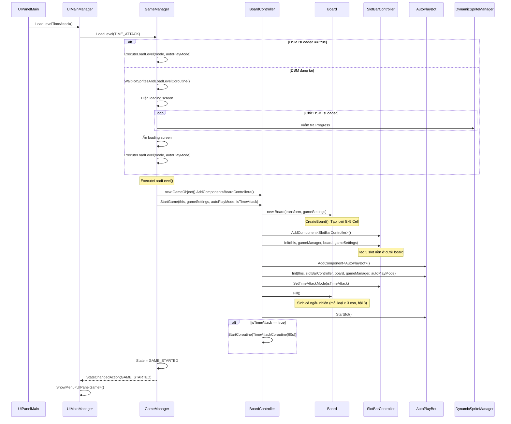

---

## 6. CƠ CHẾ TẠO BÀN CHƠI — `Board.Fill()`

### Thuật toán sinh cá:

```
Bước 1: Tính totalCells = BoardSizeX × BoardSizeY = 5×5 = 25
Bước 2: setsOfThree = totalCells / 3 = 8 (bộ 3)
Bước 3: Đảm bảo mỗi loại cá (8 loại) có ít nhất 1 bộ 3
         → 8 loại × 3 con = 24 con
Bước 4: Còn dư = 8 - 8 = 0 bộ random → 0 con thêm
Bước 5: Fill nốt ô dư = 25 - 24 = 1 con random
Bước 6: Shuffle (Fisher-Yates) xáo trộn vị trí
Bước 7: Gán mỗi cá lên ô Cell, track ImageIndex (0/1/2)
```

### Code pseudocode:
```
generatedTypes = []

// Mỗi loại 1 bộ 3
FOR EACH type IN eNormalType(8 loại):
    generatedTypes.Add(type, type, type)    // = 24 con

// Bộ random còn lại
remainingSets = setsOfThree - totalTypes = 0
FOR i = 0 TO remainingSets - 1:
    randomType = Random type
    generatedTypes.Add(randomType, randomType, randomType)

// Fill ô dư
WHILE generatedTypes.Count < totalCells:
    generatedTypes.Add(Random type)

// Xáo trộn Fisher-Yates
Shuffle(generatedTypes)

// Gán lên board
index = 0
FOR x = 0 TO boardSizeX:
  FOR y = 0 TO boardSizeY:
    item = new NormalItem()
    item.SetType(generatedTypes[index])
    item.ImageIndex = đếm thứ tự trong cùng loại % 3
    item.SetView()          // Tạo GameObject từ prefab
    item.SetViewRoot(root)  // Gắn vào BoardController.transform
    cell.Assign(item)       // Gán item vào cell
    cell.ApplyItemPosition(false)  // Đặt vị trí
```

### Cách `NormalItem.SetView()` hoạt động:

```
1. GetPrefabName() → trả về Constants path (vd: "prefabs/itemNormal01")
2. Resources.Load<GameObject>(prefabName) → load prefab
3. Instantiate(prefab) → tạo GameObject → gán vào this.View
4. Lấy DynamicSpriteManager.Instance.GetSprite(ItemType, ImageIndex)
5. Nếu sprite != null → gán vào SpriteRenderer.sprite
```

> [!IMPORTANT]
> **ImageIndex** (0, 1, 2) quyết định cá cùng loại nhưng **hiển thị hình ảnh khác nhau**.
> Mỗi set trên server có 3 URL ảnh (`imageUrl1`, `imageUrl2`, `imageUrl3`).
> Con đầu tiên dùng ảnh 1, con thứ 2 dùng ảnh 2, con thứ 3 dùng ảnh 3.
> Nhưng chúng vẫn **match được với nhau** vì `IsSameType()` chỉ so sánh `ItemType`.

---

## 7. LUỒNG CHƠI — KHI NGƯỜI CHƠI CLICK VÀO CÁ

### 7.1. Sơ đồ luồng click

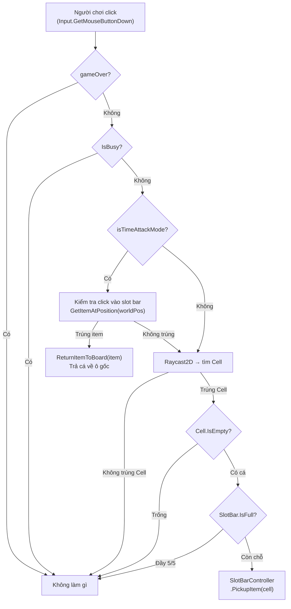

### 7.2. Chi tiết `BoardController.Update()` (mỗi frame)

```csharp
// Hàm này được gọi bởi GameManager.Update() → m_boardController.Update()
void Update()
{
    if (m_gameOver) return;     // Game đã kết thúc → skip
    if (IsBusy) return;         // Đang xử lý animation → skip

    if (Input.GetMouseButtonDown(0))  // Click trái / Touch
    {
        // [CHỈ TIME ATTACK] Kiểm tra click vào item trong slot bar → trả lại
        if (m_isTimeAttackMode)
        {
            Vector3 worldPos = Camera.ScreenToWorldPoint(Input.mousePosition);
            Item clickedItem = m_slotBarController.GetItemAtPosition(worldPos);
            if (clickedItem != null)
            {
                m_slotBarController.ReturnItemToBoard(clickedItem);
                return;  // Xử lý xong, không kiểm tra board
            }
        }

        // Raycast 2D tìm ô được click
        var hit = Physics2D.Raycast(Camera.ScreenToWorldPoint(mousePos), Vector2.zero);
        if (hit.collider != null)
        {
            Cell cell = hit.collider.GetComponent<Cell>();
            if (cell != null && !cell.IsEmpty && !m_slotBarController.IsFull)
            {
                m_slotBarController.PickupItem(cell);
            }
        }
    }
}
```

---

## 8. LUỒNG PICKUP + MATCHING — `SlotBarController`

### 8.1. Sơ đồ toàn bộ luồng PickupItem

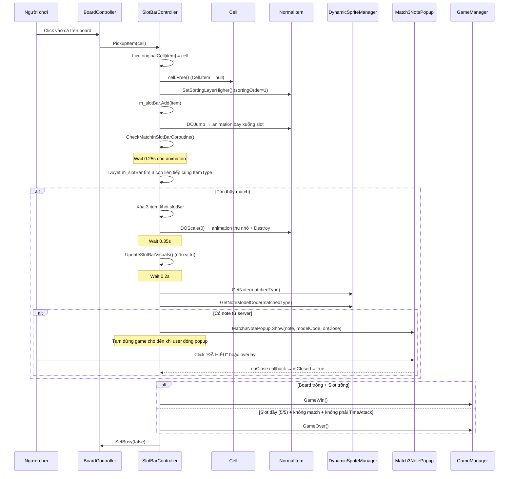

### 8.2. Chi tiết hàm `PickupItem(Cell cell)`

```
Đầu vào: Cell cell — ô chứa con cá bị click
Đầu ra: không trả giá trị

Bước 1: Cast cell.Item thành NormalItem → nếu null thì return
Bước 2: Lưu m_originalCells[item] = cell (để có thể trả lại nếu cần)
Bước 3: cell.Free() → Cell.Item = null (ô trên board giờ trống)
Bước 4: item.SetSortingLayerHigher() → SpriteRenderer.sortingOrder = 1
Bước 5: m_slotBar.Add(item)
Bước 6: Tính targetPos = slot thứ (count - 1) trong khay
Bước 7: item.View.DOJump(targetPos, 1.5f, 1, 0.35s) — animation nhảy
Bước 8: StartCoroutine(CheckMatchInSlotBarCoroutine())
```

### 8.3. Chi tiết hàm `CheckMatchInSlotBarCoroutine()`

```
Bước 1: SetBusy(true) — khóa input
Bước 2: Wait 0.25s (chờ animation nhảy)
Bước 3: Duyệt m_slotBar từ index 0 đến Count-3
    Nếu slotBar[i], slotBar[i+1], slotBar[i+2] cùng ItemType → hasMatch = true

Bước 4: NẾU có match:
    a. Lấy matchedType = ItemType của cá matched
    b. Xóa 3 item liên tiếp khỏi m_slotBar
    c. Xóa khỏi m_originalCells (không cần trả lại nữa)
    d. Animation DOScale(0) → Destroy View
    e. Wait 0.35s
    f. UpdateSlotBarVisuals() — dồn icon còn lại
    g. Wait 0.2s
    h. Lấy note = DSM.GetNote(matchedType)
    i. Lấy modelCode = DSM.GetNoteModelCode(matchedType)
    j. NẾU note không rỗng:
       - Match3NotePopup.Show(note, modelCode, onClose)
       - While (!isClosed) yield return null ← TẠM DỪNG GAME

Bước 5: Kiểm tra WIN:
    board.IsBoardEmpty() && slotBar.Count == 0 → GameWin()

Bước 6: Kiểm tra LOSE (chỉ cho NON-TimeAttack):
    slotBar.Count == 5 && !hasMatch && !isTimeAttackMode → GameOver()

Bước 7: SetBusy(false) — mở khóa input
```

> [!WARNING]
> **Lưu ý quan trọng**: Matching kiểm tra **3 con LIÊN TIẾP** trong slot bar (index i, i+1, i+2).
> Không phải tìm 3 con bất kỳ ở vị trí nào! Thứ tự đặt vào rất quan trọng.

---

## 9. SO SÁNH CÁC CHẾ ĐỘ CHƠI

### 9.1. Bảng so sánh

| Đặc điểm | TIMER (cũ) | MOVES (cũ) | TIME_ATTACK (60s) |
|-----------|-----------|------------|-------------------|
| Đếm ngược thời gian | ✅ LevelTime | ❌ | ✅ TimeAttackCoroutine (60s) |
| Đếm nước đi | ❌ | ✅ LevelMoves | ❌ |
| Thua khi hết thời gian | ✅ | ❌ | ✅ |
| Thua khi slot đầy 5/5 | ✅ | ✅ | ❌ (có thể click trả lại) |
| Trả cá về board | ❌ | ❌ | ✅ `ReturnItemToBoard()` |
| Hiện timer trên UI | ✅ LevelConditionView | ✅ LevelConditionView | ✅ Event → update Text |
| Sử dụng LevelCondition | ✅ | ✅ | ❌ (tự quản lý trong BC) |

### 9.2. Luồng Time Attack (60s) chi tiết

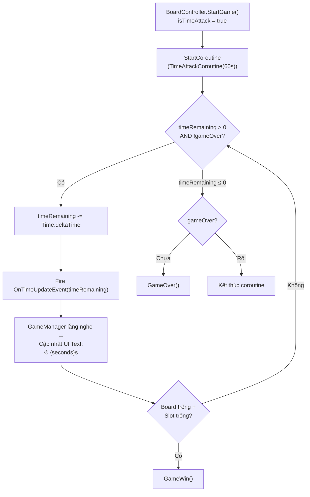

**Điểm khác biệt Time Attack:**
1. **Không thua khi slot đầy** — vì `!m_isTimeAttackMode` trong điều kiện thua
2. **Có thể click trả cá về** — `ReturnItemToBoard(item)` chỉ hoạt động khi `m_isTimeAttackMode`
3. **Đếm ngược 60s** — không dùng `LevelTime` mà dùng coroutine riêng trong `BoardController`
4. **UI timer** cập nhật qua event `OnTimeUpdateEvent` → lambda trong `GameManager.ExecuteLoadLevel()`

### 9.3. Luồng trả cá về (Time Attack only)

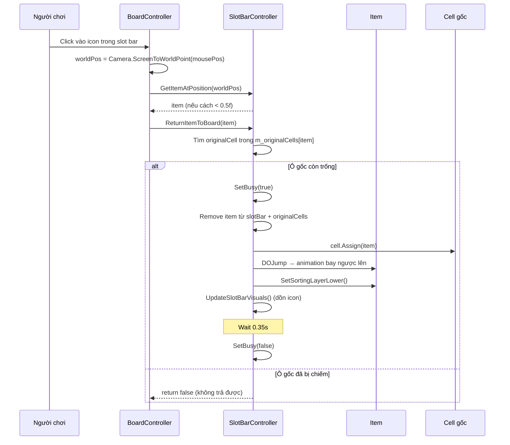

---

## 10. POPUP KIẾN THỨC LỊCH SỬ — `Match3NotePopup`

### 10.1. Cấu trúc popup

```
┌──────────────────────────────────────┐
│           Dark Overlay (85%)          │  ← Click = đóng popup
│  ┌──────────────────────────────┐     │
│  │     KIẾN THỨC LỊCH SỬ       │     │  ← Header màu vàng gold
│  │                              │     │
│  │    ┌──────────────────┐      │     │
│  │    │   Mô hình 3D     │      │     │  ← RenderTexture + Camera riêng
│  │    │   (xoay được)    │      │     │     HOẶC hình ảnh từ URL
│  │    └──────────────────┘      │     │
│  │                              │     │
│  │  "Đây là sự kiện..."        │     │  ← Nội dung note từ server
│  │                              │     │
│  │        [ĐÃ HIỂU]            │     │  ← Button teal, click = đóng
│  └──────────────────────────────┘     │
└──────────────────────────────────────┘
```

### 10.2. Hàm `Match3NotePopup.Show()` — static factory

```
Đầu vào:
  - noteText: string — nội dung kiến thức lịch sử
  - modelCode: string? — mã model 3D (lookup từ PreviewModelRegistry)
  - imageUrl: string? — URL ảnh (fallback nếu không có model)
  - onClose: Action — callback khi đóng popup

Luồng:
1. Tìm Canvas hiện có (hoặc tạo mới với sortingOrder = 10000)
2. Tạo popup root GameObject + CanvasGroup
3. Tạo overlay (dark background) + Button lắng nghe OnClickOK
4. Nếu có modelCode:
   a. Load PreviewModelRegistry từ Resources
   b. Lấy prefab model 3D
   c. Tạo RenderTexture 512×512
   d. Instantiate model ở vị trí xa (1000, 1000, 1000)
   e. Tạo Camera riêng + Light → render vào RenderTexture
   f. Hiển thị RawImage trong UI
   g. Attach UIModelRotator cho phép kéo xoay
5. Nếu có imageUrl (không có model):
   a. Tạo Image UI
   b. Dùng RemoteImageLoader tải ảnh từ URL
6. Tạo Text hiển thị noteText
7. Tạo Button "ĐÃ HIỂU"
```

---

## 11. AUTOPLAY BOT — `AutoPlayBot`

### 11.1. Luồng bot

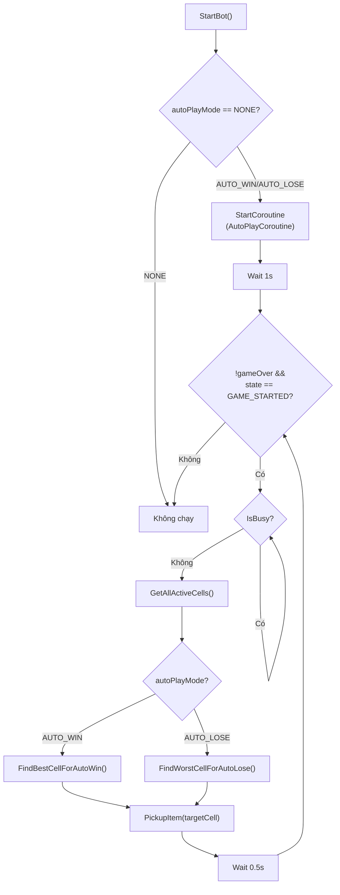

### 11.2. Chiến lược bot

| Mode | Hàm | Chiến lược |
|------|------|-----------|
| AUTO_WIN | `FindBestCellForAutoWin()` | Nhìn vào slot bar → tìm loại cá có nhiều nhất → nhặt thêm cá cùng loại trên board để hoàn thành bộ 3 |
| AUTO_LOSE | `FindWorstCellForAutoLose()` | Nhìn vào slot bar → tìm cá trên board **khác loại** với tất cả cá trong slot → nhặt để lấp đầy slot bằng cá không match |

---

## 12. LUỒNG KẾT THÚC GAME

### 12.1. Thắng — `GameManager.GameWin()`

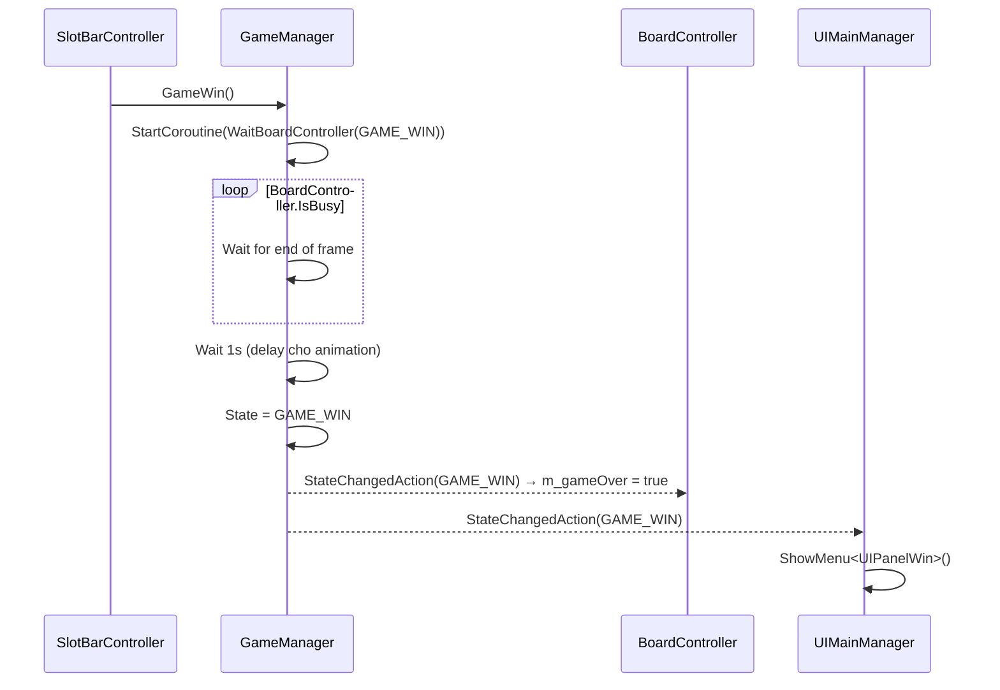

### 12.2. Thua — `GameManager.GameOver()`

Tương tự nhưng `State = GAME_OVER` → `ShowMenu<UIPanelGameOver>()`

### 12.3. Quay về menu — Nhấn Close trên panel Win/GameOver

```
UIPanelWin.OnClickClose() → UIMainManager.ShowMainMenu()
  → GameManager.ClearLevel()     // Xóa BoardController + Board
  → GameManager.SetState(MAIN_MENU) // Hiện UIPanelMain
```

### 12.4. Quay về Home — Nhấn Home

```
UIMainManager.GoHome()
  → GameManager.ClearLevel()     // Xóa board nếu đang chơi
  → SceneTransitionManager.Instance.LoadScene("HomeScene")
```

---

## 13. BẢNG TỔNG HỢP — TẤT CẢ CÁC HÀM QUAN TRỌNG

### GameManager

| Hàm | Đầu vào | Đầu ra | Mô tả |
|-----|---------|--------|-------|
| `Awake()` | — | — | Load GameSettings, tìm UIMainManager, State = SETUP |
| `Start()` | — | — | State = MAIN_MENU, preload dynamic sprites |
| `LoadLevel(mode)` | `eLevelMode` | — | Gọi LoadLevel(mode, NONE) |
| `LoadLevel(mode, autoPlay)` | `eLevelMode`, `eAutoPlayMode` | — | Kiểm tra sprites loaded → ExecuteLoadLevel |
| `ExecuteLoadLevel(mode, autoPlay)` | `eLevelMode`, `eAutoPlayMode` | — | Tạo BoardController, gọi StartGame, State = GAME_STARTED |
| `GameWin()` | — | — | Chờ board xong → State = GAME_WIN |
| `GameOver()` | — | — | Chờ board xong → State = GAME_OVER |
| `ClearLevel()` | — | — | Destroy BoardController + Board |
| `SetState(state)` | `eStateGame` | — | Set state, pause/play DOTween |

### BoardController

| Hàm | Đầu vào | Đầu ra | Mô tả |
|-----|---------|--------|-------|
| `StartGame(gm, settings, autoPlay, isTimeAttack)` | GameManager, GameSettings, eAutoPlayMode, bool | — | Tạo Board, SlotBar, Bot, Fill, chạy timer |
| `Update()` | — | — | Xử lý click input → PickupItem hoặc ReturnItem |
| `TimeAttackCoroutine(60f)` | float totalTime | IEnumerator | Đếm ngược, fire event, check win/lose |
| `SetBusy(state)` | bool | — | Khóa/mở input |
| `Clear()` | — | — | Xóa board |

### SlotBarController

| Hàm | Đầu vào | Đầu ra | Mô tả |
|-----|---------|--------|-------|
| `Init(bc, gm, board, settings)` | BoardController, GameManager, Board, GameSettings | — | Tạo 5 slot nền, tính vị trí |
| `PickupItem(cell)` | Cell | — | Nhấc cá → bay xuống slot → check match |
| `ReturnItemToBoard(item)` | Item | bool | Trả cá về ô gốc (Time Attack only) |
| `CheckMatchInSlotBarCoroutine()` | — | IEnumerator | Tìm 3 con liên tiếp, xóa, popup, check win/lose |
| `GetItemAtPosition(worldPos)` | Vector3 | Item? | Tìm cá trong slot gần vị trí click |
| `UpdateSlotBarVisuals()` | — | — | Dồn icon trong slot bar |

### Board

| Hàm | Đầu vào | Đầu ra | Mô tả |
|-----|---------|--------|-------|
| `Board(transform, settings)` | Transform, GameSettings | — | Tạo lưới Cell 5×5, set neighbours |
| `Fill()` | — | — | Sinh cá random (bội 3), shuffle, gán lên cell |
| `IsBoardEmpty()` | — | bool | Kiểm tra tất cả cell trống |
| `GetAllActiveCells()` | — | `List<Cell>` | Lấy các cell còn cá |
| `Shuffle()` | — | — | Xáo trộn vị trí cá trên board |
| `Clear()` | — | — | Destroy tất cả cell + item |

---

## 14. SƠ ĐỒ LUỒNG DỮ LIỆU HOÀN CHỈNH

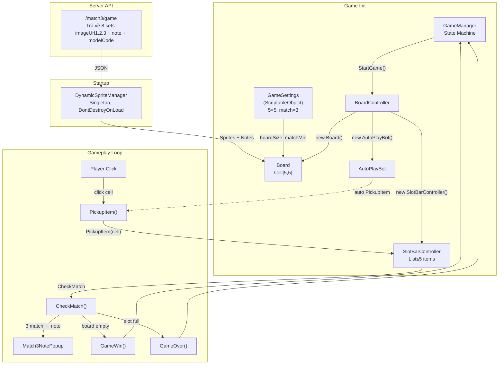

---

## 15. CÁC FILE & VỊ TRÍ PREFAB

| Constant | Đường dẫn | Dùng cho |
|----------|-----------|----------|
| `GAME_SETTINGS_PATH` | `Resources/gamesettings` | ScriptableObject cấu hình game |
| `PREFAB_CELL_BACKGROUND` | `Resources/prefabs/cellBackground` | Nền mỗi ô (cả board và slot) |
| `PREFAB_NORMAL_TYPE_ONE..EIGHT` | `Resources/prefabs/itemNormal01..08` | Prefab cá 8 loại |
| `PREFAB_BONUS_HORIZONTAL` | `Resources/prefabs/itemBonusHorizontal` | Bonus nổ hàng ngang |
| `PREFAB_BONUS_VERTICAL` | `Resources/prefabs/itemBonusVertical` | Bonus nổ hàng dọc |
| `PREFAB_BONUS_BOMB` | `Resources/prefabs/itemBonusBomb` | Bonus nổ vùng 3×3 |

---

## 16. EVENT FLOW — LUỒNG SỰ KIỆN

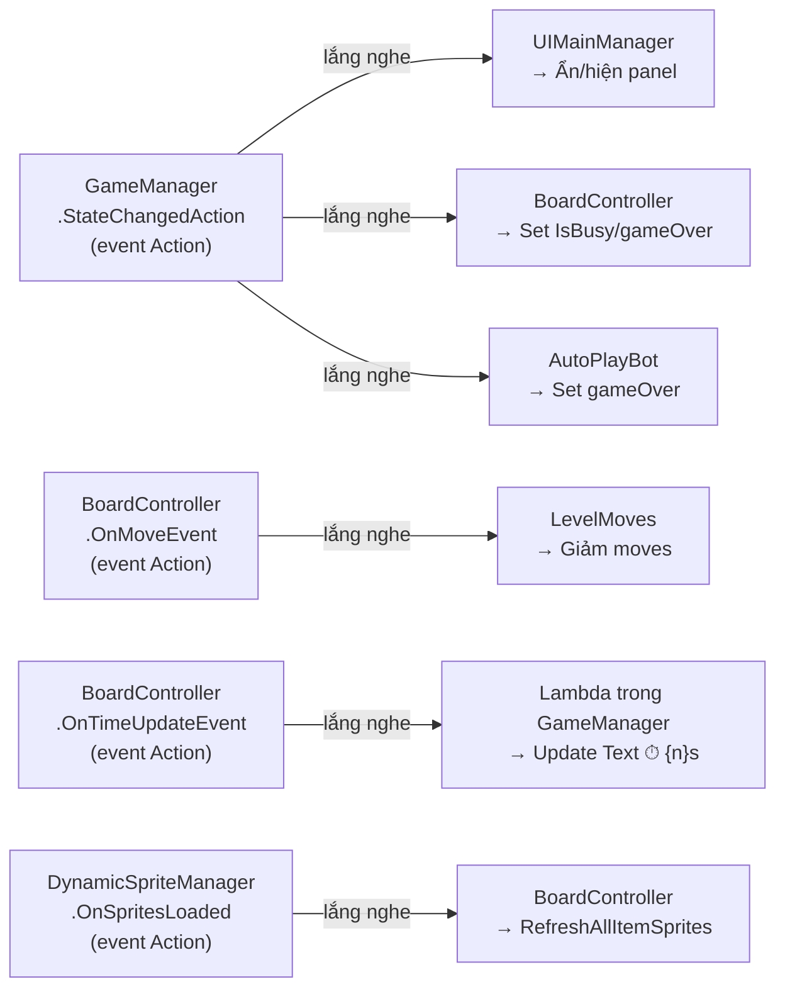

---

## 17. TÓM TẮT — CÁCH ĐỌC NHANH

> [!TIP]
> **Nếu bị hỏi "click vào cá thì xảy ra gì?"**
> → `BoardController.Update()` → `Physics2D.Raycast` → `Cell` → `SlotBarController.PickupItem(cell)` → `CheckMatchInSlotBarCoroutine()` → match 3 → popup → check win/lose

> [!TIP]
> **Nếu bị hỏi "board sinh cá thế nào?"**
> → `Board.Fill()`: mỗi 8 loại ×3 = 24, dư 1 random, shuffle Fisher-Yates, gán NormalItem lên Cell

> [!TIP]
> **Nếu bị hỏi "thắng/thua khi nào?"**
> → Thắng: `board.IsBoardEmpty() && slotBar.Count == 0`
> → Thua (non-TimeAttack): `slotBar.Count == 5 && !hasMatch`
> → Thua (TimeAttack): `timeRemaining <= 0`

> [!TIP]
> **Nếu bị hỏi "Time Attack khác gì?"**
> → Có timer 60s, slot đầy KHÔNG thua, có thể click trả cá về ô gốc

> [!TIP]
> **Nếu bị hỏi "hình cá lấy từ đâu?"**
> → API `/match3/game` → 8 sets × 3 URLs → `DynamicSpriteManager` download + cache disk → `NormalItem.SetView()` gán sprite
